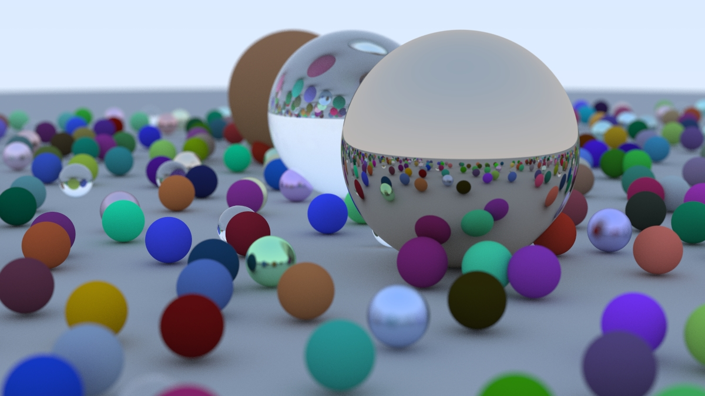

## Raytacing in One Weekend - Lucas Dunker

An implementation of the famous “Ray Tracing in One Weekend” by Peter Shirley, Trevor David Black, and Steve Hollasch. 

[_Ray Tracing in One Weekend_](https://raytracing.github.io/books/RayTracingInOneWeekend.html)

To compile the final image for the textbook, run the following commands:

- `./build_scripts.sh`
- `./build/Release/raytracer > image.ppm`
- if imagemagick is installed: `display image.ppm`

  

